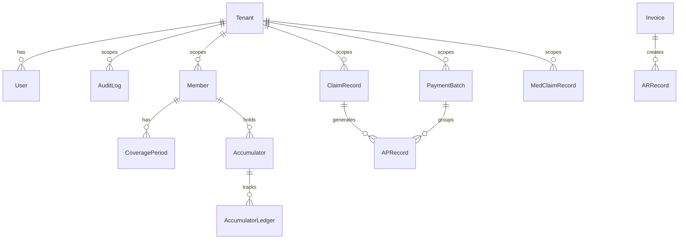

# Entity Relationship Diagram

**Last updated:** 2026-04-14  
**Covers:** core, billing, member, medical_claims schemas  
**Tool:** Mermaid `erDiagram` — render at https://mermaid.live

---

## Render the ERD

Paste the contents of `erd.mermaid` into https://mermaid.live to render
the diagram. GitHub's Markdown renderer also renders Mermaid diagrams
natively in `.md` files — see below.



For the full ERD including all column definitions, open `erd.mermaid`.

---

## Schema Descriptions

### Core Schema (`core`)

Owned by `modules/core-platform`. Shared across all modules. **Locked after Phase 1.**

| Table | Purpose |
|---|---|
| `tenants` | One row per client organization. Controls MFA, session, and feature flags. |
| `users` | Platform users with JWT-authenticated access. MFA secrets stored encrypted. |
| `audit_log` | Tamper-evident hash-chained audit trail. Every mutating action logged. |
| `sessions` | JWT session tokens. Enforces 15-minute inactivity timeout and max 5 concurrent sessions. |
| `api_keys` | SHA-256 hashed API keys for service-to-service authentication. |
| `roles` / `permissions` | RBAC role definitions and permission assignments. |

All tables with `tenant_id` use `TenantScopedMixin` which installs a SQLAlchemy
loader criterion that adds `WHERE tenant_id = :current_tenant_id` to every query.

### Billing Schema (`billing`)

Owned by `modules/billing`. Manages the complete financial life-cycle for pharmacy claims.

| Table | Purpose |
|---|---|
| `claim_records` | Ingested pharmacy claims with routing and status tracking. |
| `routing_rules` | Configurable rules that assign claims to payment routes. |
| `payment_batches` | Groupings of AP records for batch submission (ACH/check/wire). |
| `ap_records` | Accounts-payable line items, one per routed claim. |
| `invoices` | Client invoices generated from AR accrual. |
| `ar_records` | Accounts-receivable lines against client invoices. |
| `journal_entries` | Hash-chained double-entry journal (HIPAA §164.312(b) equivalent for financial data). |
| `program_budgets` | Budget limits per plan/program with alert thresholds. |
| `fee_configs` | 8-type fee configuration (dispensing, ingredient cost, DIR, copay, etc.). |

All money columns use `sa.Numeric(19, 4)` or `sa.Numeric(19, 2)` — never `Float`.

### Member Schema (`member`)

Owned by `modules/member-management`. Stores all PHI for plan members.

| Table | Purpose |
|---|---|
| `members` | Core demographic record. All PHI fields use `EncryptedString` (AES-256-GCM). |
| `groups` | Plan sponsor / group structures. |
| `coverage_periods` | Effective/termination dates per plan enrollment. Benefit phase tracked. |
| `accumulators` | Year-to-date deductible, OOP max, copay accumulator balances. |
| `accumulator_ledger` | Audit trail of every accumulator delta with claim reference. |
| `cob_records` | Coordination of Benefits (primary/secondary plan) per member. |
| `enrollment_files` | 834 EDI / CSV file metadata for ingestion tracking. |
| `eligibility_checks` | 270/271 eligibility inquiry/response log. |

PHI access is logged per `phi-compliance.md` with `action="phi_access"`.

### Medical Claims Schema (`medical_claims`)

Owned by `modules/medical-claims`. Processes CMS-1500 and UB-04 professional/institutional claims.

| Table | Purpose |
|---|---|
| `claim_records` | Full medical claim record (professional and institutional). PHI columns **currently stored plaintext — audit CR-02, production blocker**. |
| `hcpcs_ndc_crosswalk` | Maps HCPCS/J-codes to 11-digit NDCs for drug spend reporting. |
| `asp_pricing` | CMS Average Sales Price data by quarter for Part B drug reimbursement. |
| `unified_drug_spend` | Tenant-level drug spend aggregates combining pharmacy and medical claims. |

**Critical audit finding (CR-02):** `patient_member_id`, `rendering_provider_npi`,
and diagnosis codes are stored as plaintext `String` columns, violating
HIPAA §164.312(a)(2)(iv). Migration to `EncryptedString` is tracked as a
production blocker.

---

## Cross-Module Data Flow

```
834/CSV ingest
    → member.members (via member-management)
    → claim.adjudicated event
        → billing.claim_records
            → billing.ap_records
                → payment_batch.generated event
                    → payment-processing submission
                        → payment.settled event
                            → billing.journal_entries
```

No module reads directly from another module's schema.
Cross-module data flows exclusively via API calls and the event bus.

---

## Adding New Schemas

When a new module is built:
1. Create a module-local `DeclarativeBase` with `schema="<module_name>"`.
2. Inherit `TenantScopedMixin` on every tenant-owned table.
3. Use `PHIMixin` on any table with patient data.
4. Add Alembic migrations under `modules/<name>/alembic/versions/`.
5. Update this ERD document and `erd.mermaid`.

See `docs/adr/ADR-001-monorepo-layout.md` for module structure rules.

---

**Last reviewed:** 2026-04-14
